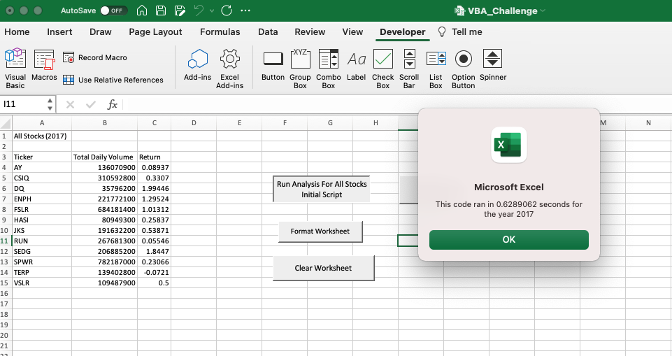
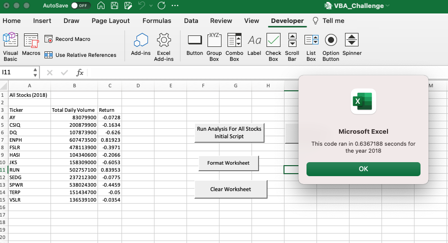
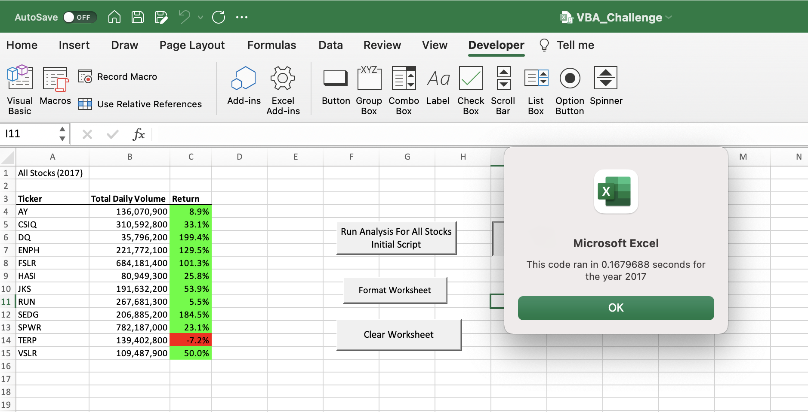
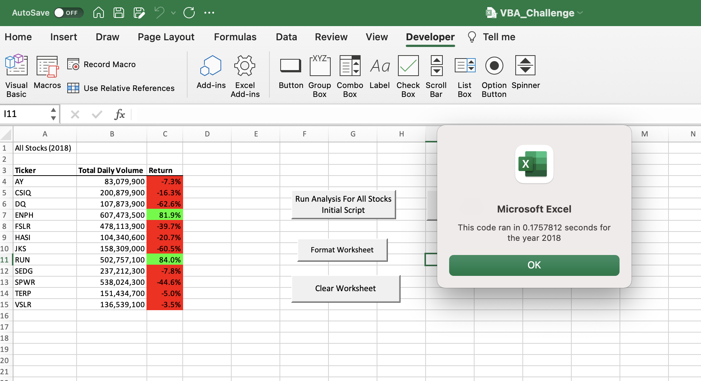

# VBA Challenge - Refactor 

## Overview of Project

The purpose of this module was to learn VBA and to re-think how an existing VBA script can be restructured in order to run more efficiently (refactor an existing script).  As we learned VBA we generated a script to help us analyze a series of stocks, their transaction volumes and each stocks return.  This script successfully produced a table that helped us to summarize and analyze that performance.  We were then challenged to re-think how this script could be changed to get the same results and then analyze the efficiencies of the two different scripts.

## Results

### The Refactored Code was more efficient than the original code as measured by the time it took to run the scripts

   - The original code took on average .6328125 seconds to run for 2017 and 2018 data.  Note the 2018 data takes slightly longer to run than the 2017 data

   - The refactored code took on average .171875 seconds to run for 2017 and 2018 data.  Again the 2018 data took slightly longer to run than the 2017 data
	

### The differences between the refactored and original code
   - The original script utilized nested loops while the refactored script used three loops that were not nested
   - The refactored script created 4 arrays while the original script had 1 array
   - The refactored script utilized an index which eliminated the need for the nested loops

## Summary

### Benefits of Refactoring Code
   - In a learning environment refactoring code allows students to learn different techniques to accomplish the same outcome.  In addition students learned that there are more efficient ways to accomplish the same outcome
   - In a business setting refactoring code may help to
	* improve efficiencies
	* find errors
	* guarantee a group of people are familiar with the code

### Disadvantages of Refactoring Code
   - In a learning environment refactoring can cause frustration as people realize that there is no one right solution.  This would also indicate that there is no end to an exercise, you may always be able to do better.
   - In a business setting refactoring code may increase costs as employees take time to figure out the best code.  Both time and money are a limited commodity that needs to be utilized efficiently.

### Pros and Cons of the original and Refactored VBA Script
  - The refactored script runs faster than the original script.  With larger data sets this time saving could be important
  - The original script worked and provided a good shell to improve on.  Sometimes it may be better to use what you know to get a foundation set and then improve on it when there is time and you have gathered additional information.
 

